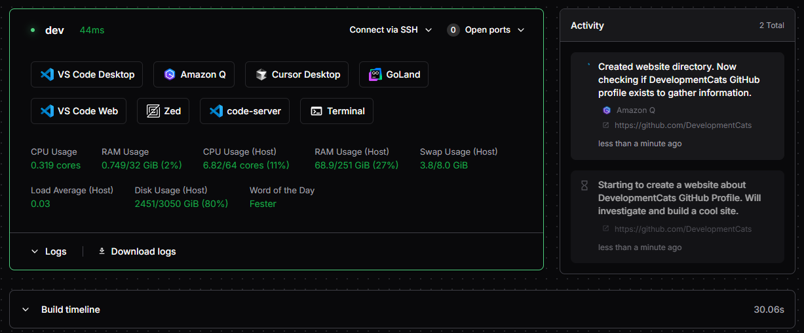

# Amazon Q

Run [Amazon Q](https://aws.amazon.com/q/) in your workspace to access Amazon's AI coding assistant. This module installs and launches Amazon Q, with support for background operation, task reporting, and custom pre/post install scripts.

```tf
module "amazon-q" {
  source   = "registry.coder.com/modules/amazon-q/coder"
  version  = "1.0.0"
  agent_id = coder_agent.example.id
  # Required: see below for how to generate
  experiment_auth_tarball = var.amazon_q_auth_tarball
}
```



## Prerequisites

- You must generate an authenticated Amazon Q tarball on another machine:
  ```sh
  cd ~/.local/share/amazon-q && tar -c . | zstd | base64 -w 0
  ```
  Paste the result into the `experiment_auth_tarball` variable.
- To run in the background, your workspace must have `screen` or `tmux` installed.

<details>
<summary><strong>How to generate the Amazon Q auth tarball (step-by-step)</strong></summary>

**1. Install and authenticate Amazon Q on your local machine:**

- Download and install Amazon Q from the [official site](https://aws.amazon.com/q/developer/).
- Run `q login` and complete the authentication process in your terminal.

**2. Locate your Amazon Q config directory:**

- The config is typically stored at `~/.local/share/amazon-q`.

**3. Generate the tarball:**

- Run the following command in your terminal:
  ```sh
  cd ~/.local/share/amazon-q
  tar -c . | zstd | base64 -w 0
  ```

**4. Copy the output:**

- The command will output a long string. Copy this entire string.

**5. Paste into your Terraform variable:**

- Assign the string to the `experiment_auth_tarball` variable in your Terraform configuration, for example:
  ```tf
  variable "amazon_q_auth_tarball" {
    type    = string
    default = "PASTE_LONG_STRING_HERE"
  }
  ```

**Note:**

- You must re-generate the tarball if you log out or re-authenticate Amazon Q on your local machine.
- This process is required for each user who wants to use Amazon Q in their workspace.

[Reference: Amazon Q documentation](https://docs.aws.amazon.com/amazonq/latest/qdeveloper-ug/generate-docs.html)

</details>

## Examples

### Run Amazon Q in the background with tmux

```tf
module "amazon-q" {
  source                  = "registry.coder.com/modules/amazon-q/coder"
  version                 = "1.0.0"
  agent_id                = coder_agent.example.id
  experiment_auth_tarball = var.amazon_q_auth_tarball
  experiment_use_tmux     = true
}
```

### Enable task reporting (experimental)

```tf
module "amazon-q" {
  source                  = "registry.coder.com/modules/amazon-q/coder"
  version                 = "1.0.0"
  agent_id                = coder_agent.example.id
  experiment_auth_tarball = var.amazon_q_auth_tarball
  experiment_report_tasks = true
}
```

### Run custom scripts before/after install

```tf
module "amazon-q" {
  source                         = "registry.coder.com/modules/amazon-q/coder"
  version                        = "1.0.0"
  agent_id                       = coder_agent.example.id
  experiment_auth_tarball        = var.amazon_q_auth_tarball
  experiment_pre_install_script  = "echo Pre-install!"
  experiment_post_install_script = "echo Post-install!"
}
```

## Variables

| Name                             | Required | Default                  | Description                                                                                     |
| -------------------------------- | -------- | ------------------------ | ----------------------------------------------------------------------------------------------- |
| `agent_id`                       | Yes      | —                        | The ID of a Coder agent.                                                                        |
| `experiment_auth_tarball`        | Yes      | —                        | Base64-encoded, zstd-compressed tarball of a pre-authenticated Amazon Q config directory.       |
| `install_amazon_q`               | No       | `true`                   | Whether to install Amazon Q.                                                                    |
| `amazon_q_version`               | No       | `latest`                 | Version to install.                                                                             |
| `experiment_use_screen`          | No       | `false`                  | Use GNU screen for background operation.                                                        |
| `experiment_use_tmux`            | No       | `false`                  | Use tmux for background operation.                                                              |
| `experiment_report_tasks`        | No       | `false`                  | Enable task reporting to Coder.                                                                 |
| `experiment_pre_install_script`  | No       | `null`                   | Custom script to run before install.                                                            |
| `experiment_post_install_script` | No       | `null`                   | Custom script to run after install.                                                             |
| `icon`                           | No       | `/icon/amazon-q.svg`     | The icon to use for the app.                                                                    |
| `folder`                         | No       | `/home/coder`            | The folder to run Amazon Q in.                                                                  |
| `order`                          | No       | `null`                   | The order determines the position of app in the UI presentation.                                |
| `system_prompt`                  | No       | See [main.tf](./main.tf) | The system prompt to use for Amazon Q. This should instruct the agent how to do task reporting. |
| `ai_prompt`                      | No       | See [main.tf](./main.tf) | The initial task prompt to send to Amazon Q.                                                    |

## Notes

- Only one of `experiment_use_screen` or `experiment_use_tmux` can be true at a time.
- If neither is set, Amazon Q runs in the foreground.
- For more details, see the [main.tf](./main.tf) source.
