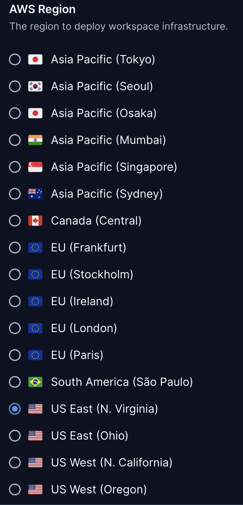
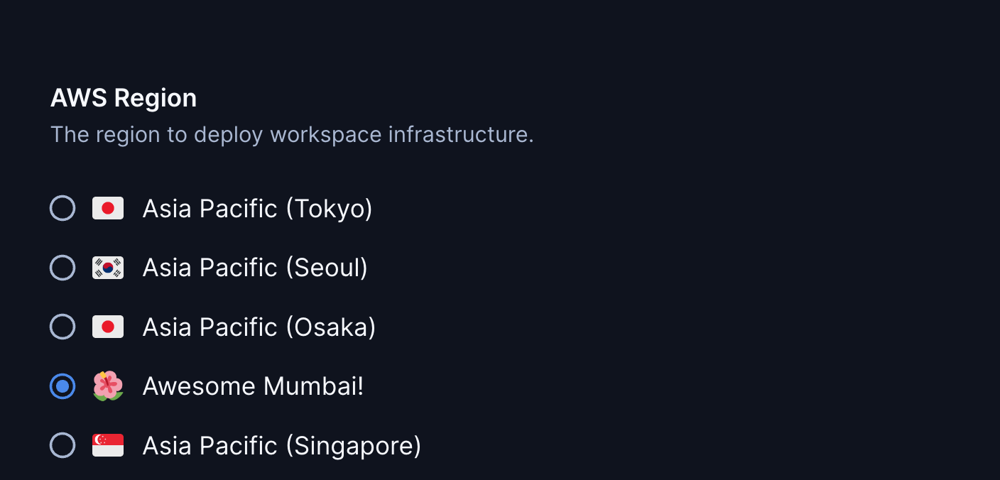
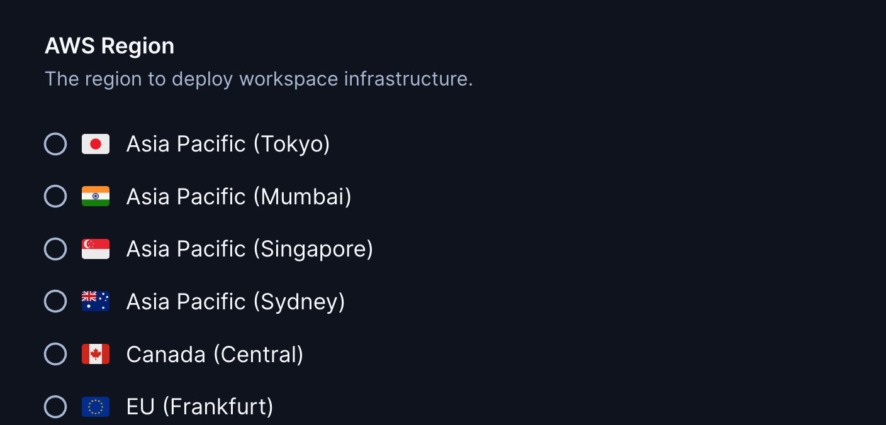

# AWS Region

A parameter with all AWS regions. This allows developers to select
the region closest to them.

Customize the preselected parameter value:

```tf
module "aws-region" {
  count   = data.coder_workspace.me.start_count
  source  = "registry.coder.com/modules/aws-region/coder"
  version = "1.0.12"
  default = "us-east-1"
}

provider "aws" {
  region = module.aws_region.value
}
```



## Examples

### Customize regions

Change the display name and icon for a region using the corresponding maps:

```tf
module "aws-region" {
  count   = data.coder_workspace.me.start_count
  source  = "registry.coder.com/modules/aws-region/coder"
  version = "1.0.12"
  default = "ap-south-1"

  custom_names = {
    "ap-south-1" : "Awesome Mumbai!"
  }

  custom_icons = {
    "ap-south-1" : "/emojis/1f33a.png"
  }
}

provider "aws" {
  region = module.aws_region.value
}
```



### Exclude regions

Hide the Asia Pacific regions Seoul and Osaka:

```tf
module "aws-region" {
  count   = data.coder_workspace.me.start_count
  source  = "registry.coder.com/modules/aws-region/coder"
  version = "1.0.12"
  exclude = ["ap-northeast-2", "ap-northeast-3"]
}

provider "aws" {
  region = module.aws_region.value
}
```



## Related templates

For a complete AWS EC2 template, see the following examples in the [Coder Registry](https://registry.coder.com/).

- [AWS EC2 (Linux)](https://registry.coder.com/templates/aws-linux)
- [AWS EC2 (Windows)](https://registry.coder.com/templates/aws-windows)
