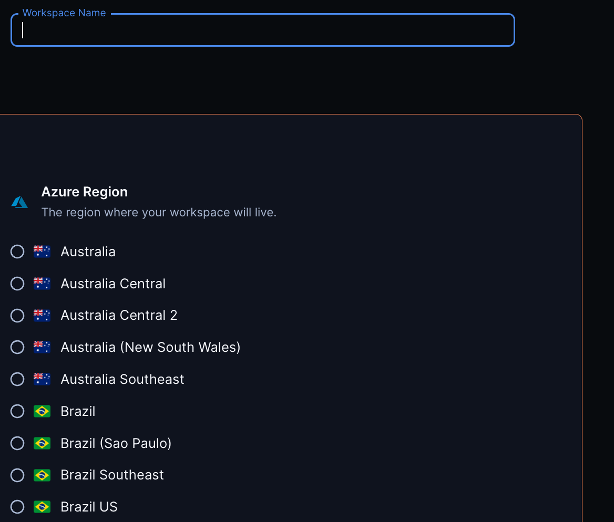
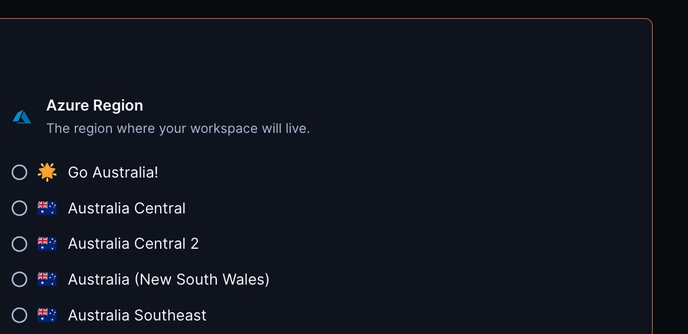
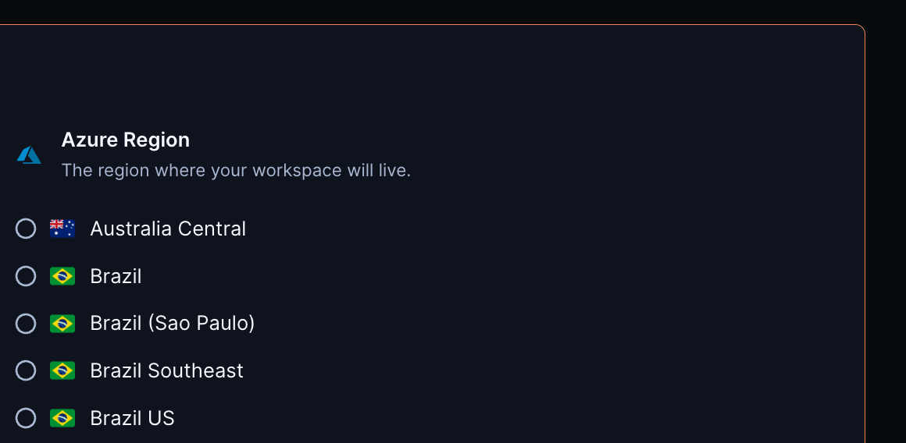

# Azure Region

This module adds a parameter with all Azure regions, allowing developers to select the region closest to them.

```tf
module "azure_region" {
  count   = data.coder_workspace.me.start_count
  source  = "registry.coder.com/modules/azure-region/coder"
  version = "1.0.12"
  default = "eastus"
}

resource "azurem_resource_group" "example" {
  location = module.azure_region.value
}
```



## Examples

### Customize existing regions

Change the display name and icon for a region using the corresponding maps:

```tf
module "azure-region" {
  count   = data.coder_workspace.me.start_count
  source  = "registry.coder.com/modules/azure-region/coder"
  version = "1.0.12"
  custom_names = {
    "australia" : "Go Australia!"
  }
  custom_icons = {
    "australia" : "/icons/smiley.svg"
  }
}

resource "azurerm_resource_group" "example" {
  location = module.azure_region.value
}
```



### Exclude Regions

Hide all regions in Australia except australiacentral:

```tf
module "azure-region" {
  count   = data.coder_workspace.me.start_count
  source  = "registry.coder.com/modules/azure-region/coder"
  version = "1.0.12"
  exclude = [
    "australia",
    "australiacentral2",
    "australiaeast",
    "australiasoutheast"
  ]
}

resource "azurerm_resource_group" "example" {
  location = module.azure_region.value
}
```



## Related templates

For a complete Azure template, see the following examples in the [Coder Registry](https://registry.coder.com/).

- [Azure VM (Linux)](https://registry.coder.com/templates/azure-linux)
- [Azure VM (Windows)](https://registry.coder.com/templates/azure-windows)
