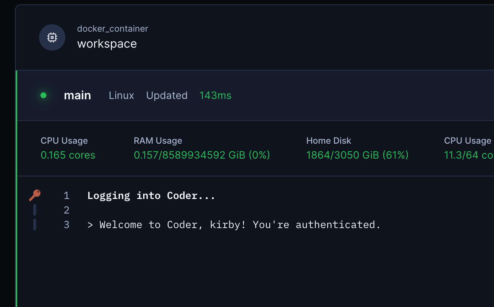

# Coder Login

Automatically logs the user into Coder when creating their workspace.

```tf
module "coder-login" {
  count    = data.coder_workspace.me.start_count
  source   = "registry.coder.com/modules/coder-login/coder"
  version  = "1.0.15"
  agent_id = coder_agent.example.id
}
```


