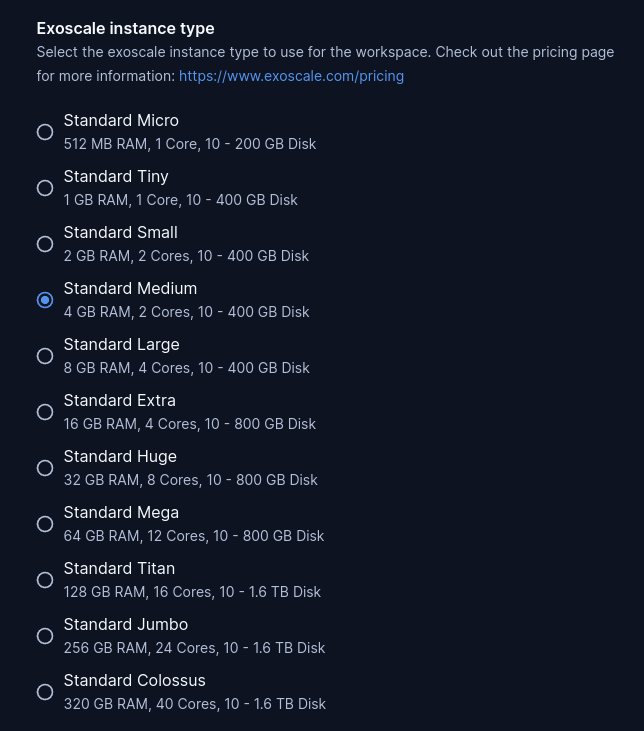
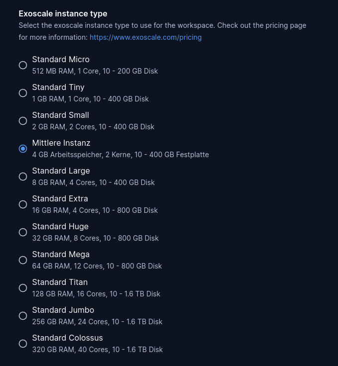
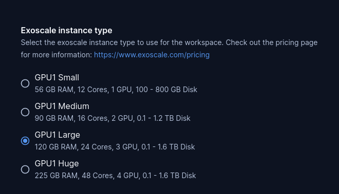

# exoscale-instance-type

A parameter with all Exoscale instance types. This allows developers to select
their desired virtual machine for the workspace.

Customize the preselected parameter value:

```tf
module "exoscale-instance-type" {
  count   = data.coder_workspace.me.start_count
  source  = "registry.coder.com/modules/exoscale-instance-type/coder"
  version = "1.0.12"
  default = "standard.medium"
}

resource "exoscale_compute_instance" "instance" {
  type = module.exoscale-instance-type.value
  # ...
}

resource "coder_metadata" "workspace_info" {
  item {
    key   = "instance type"
    value = module.exoscale-instance-type.name
  }
}
```



## Examples

### Customize type

Change the display name a type using the corresponding maps:

```tf
module "exoscale-instance-type" {
  count   = data.coder_workspace.me.start_count
  source  = "registry.coder.com/modules/exoscale-instance-type/coder"
  version = "1.0.12"
  default = "standard.medium"

  custom_names = {
    "standard.medium" : "Mittlere Instanz" # German translation
  }

  custom_descriptions = {
    "standard.medium" : "4 GB Arbeitsspeicher, 2 Kerne, 10 - 400 GB Festplatte" # German translation
  }
}

resource "exoscale_compute_instance" "instance" {
  type = module.exoscale-instance-type.value
  # ...
}

resource "coder_metadata" "workspace_info" {
  item {
    key   = "instance type"
    value = module.exoscale-instance-type.name
  }
}
```



### Use category and exclude type

Show only gpu1 types

```tf
module "exoscale-instance-type" {
  count         = data.coder_workspace.me.start_count
  source        = "registry.coder.com/modules/exoscale-instance-type/coder"
  version       = "1.0.12"
  default       = "gpu.large"
  type_category = ["gpu"]
  exclude = [
    "gpu2.small",
    "gpu2.medium",
    "gpu2.large",
    "gpu2.huge",
    "gpu3.small",
    "gpu3.medium",
    "gpu3.large",
    "gpu3.huge"
  ]
}

resource "exoscale_compute_instance" "instance" {
  type = module.exoscale-instance-type.value
  # ...
}

resource "coder_metadata" "workspace_info" {
  item {
    key   = "instance type"
    value = module.exoscale-instance-type.name
  }
}
```



## Related templates

A related exoscale template will be provided soon.
