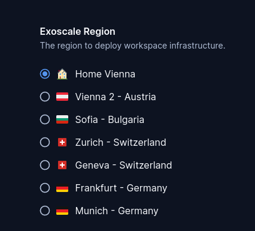

# exoscale-zone

A parameter with all Exoscale zones. This allows developers to select
the zone closest to them.

Customize the preselected parameter value:

```tf
module "exoscale-zone" {
  count   = data.coder_workspace.me.start_count
  source  = "registry.coder.com/modules/exoscale-zone/coder"
  version = "1.0.12"
  default = "ch-dk-2"
}


data "exoscale_compute_template" "my_template" {
  zone = module.exoscale-zone.value
  name = "Linux Ubuntu 22.04 LTS 64-bit"
}

resource "exoscale_compute_instance" "instance" {
  zone = module.exoscale-zone.value
  # ...
}
```


## Examples

### Customize zones

Change the display name and icon for a zone using the corresponding maps:

```tf
module "exoscale-zone" {
  count   = data.coder_workspace.me.start_count
  source  = "registry.coder.com/modules/exoscale-zone/coder"
  version = "1.0.12"
  default = "at-vie-1"

  custom_names = {
    "at-vie-1" : "Home Vienna"
  }

  custom_icons = {
    "at-vie-1" : "/emojis/1f3e0.png"
  }
}

data "exoscale_compute_template" "my_template" {
  zone = module.exoscale-zone.value
  name = "Linux Ubuntu 22.04 LTS 64-bit"
}

resource "exoscale_compute_instance" "instance" {
  zone = module.exoscale-zone.value
  # ...
}
```



### Exclude regions

Hide the Switzerland zones Geneva and Zurich

```tf
module "exoscale-zone" {
  source  = "registry.coder.com/modules/exoscale-zone/coder"
  version = "1.0.12"
  exclude = ["ch-gva-2", "ch-dk-2"]
}

data "exoscale_compute_template" "my_template" {
  zone = module.exoscale-zone.value
  name = "Linux Ubuntu 22.04 LTS 64-bit"
}

resource "exoscale_compute_instance" "instance" {
  zone = module.exoscale-zone.value
  # ...
}
```


## Related templates

An exoscale sample template will be delivered soon.
