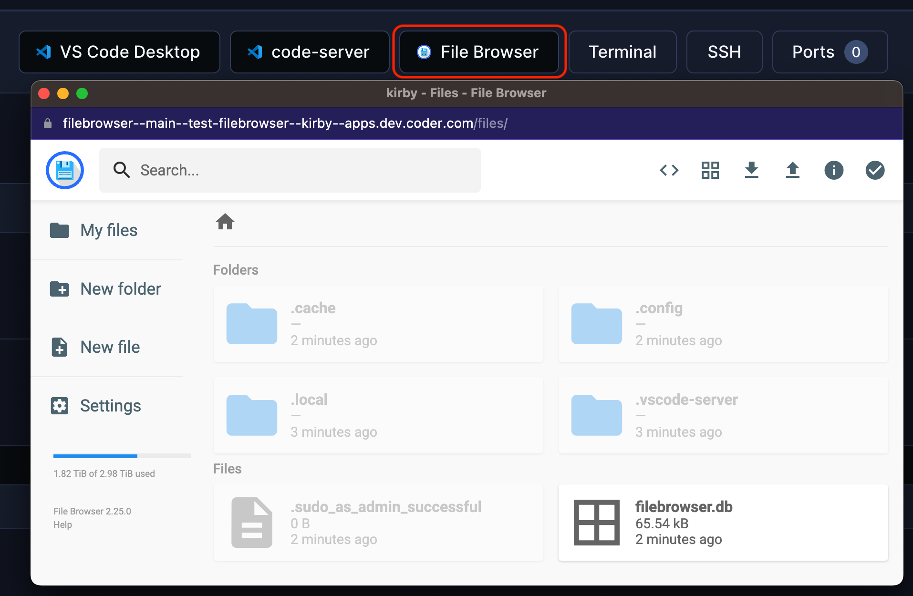

# File Browser

A file browser for your workspace.

```tf
module "filebrowser" {
  count    = data.coder_workspace.me.start_count
  source   = "registry.coder.com/modules/filebrowser/coder"
  version  = "1.0.31"
  agent_id = coder_agent.example.id
}
```



## Examples

### Serve a specific directory

```tf
module "filebrowser" {
  count    = data.coder_workspace.me.start_count
  source   = "registry.coder.com/modules/filebrowser/coder"
  version  = "1.0.31"
  agent_id = coder_agent.example.id
  folder   = "/home/coder/project"
}
```

### Specify location of `filebrowser.db`

```tf
module "filebrowser" {
  count         = data.coder_workspace.me.start_count
  source        = "registry.coder.com/modules/filebrowser/coder"
  version       = "1.0.31"
  agent_id      = coder_agent.example.id
  database_path = ".config/filebrowser.db"
}
```

### Serve from the same domain (no subdomain)

```tf
module "filebrowser" {
  count      = data.coder_workspace.me.start_count
  source     = "registry.coder.com/modules/filebrowser/coder"
  version    = "1.0.31"
  agent_id   = coder_agent.example.id
  agent_name = "main"
  subdomain  = false
}
```
