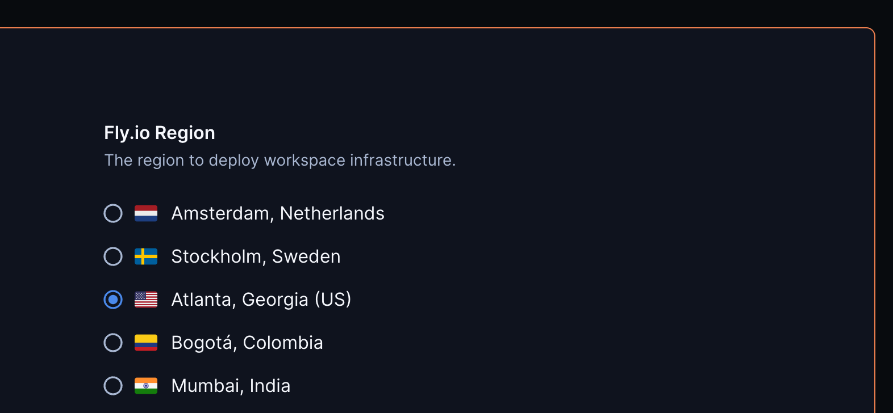
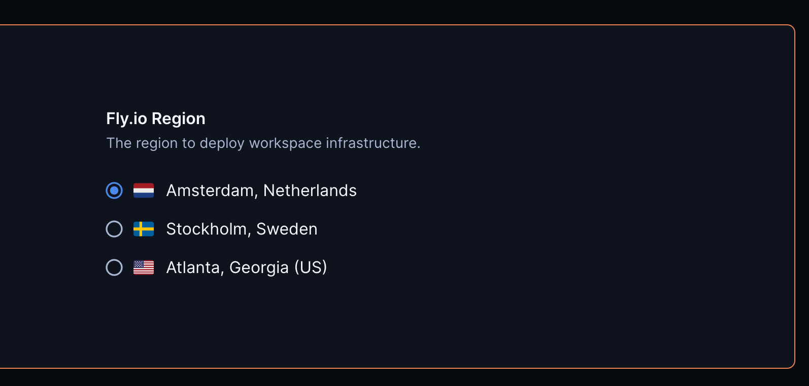
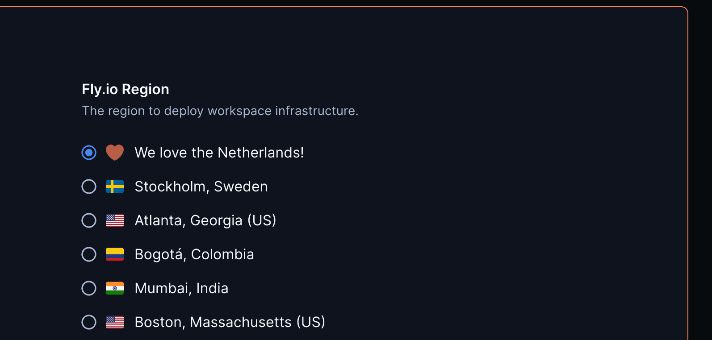

# Fly.io Region

This module adds Fly.io regions to your Coder template. Regions can be whitelisted using the `regions` argument and given custom names and custom icons with their respective map arguments (`custom_names`, `custom_icons`).

We can use the simplest format here, only adding a default selection as the `atl` region.

```tf
module "fly-region" {
  count   = data.coder_workspace.me.start_count
  source  = "registry.coder.com/modules/fly-region/coder"
  version = "1.0.2"
  default = "atl"
}
```



## Examples

### Using region whitelist

The regions argument can be used to display only the desired regions in the Coder parameter.

```tf
module "fly-region" {
  count   = data.coder_workspace.me.start_count
  source  = "registry.coder.com/modules/fly-region/coder"
  version = "1.0.2"
  default = "ams"
  regions = ["ams", "arn", "atl"]
}
```



### Using custom icons and names

Set custom icons and names with their respective maps.

```tf
module "fly-region" {
  count   = data.coder_workspace.me.start_count
  source  = "registry.coder.com/modules/fly-region/coder"
  version = "1.0.2"
  default = "ams"

  custom_icons = {
    "ams" = "/emojis/1f90e.png"
  }

  custom_names = {
    "ams" = "We love the Netherlands!"
  }
}
```



## Associated template

Also see the Coder template registry for a [Fly.io template](https://registry.coder.com/templates/fly-docker-image) that provisions workspaces as Fly.io machines.
