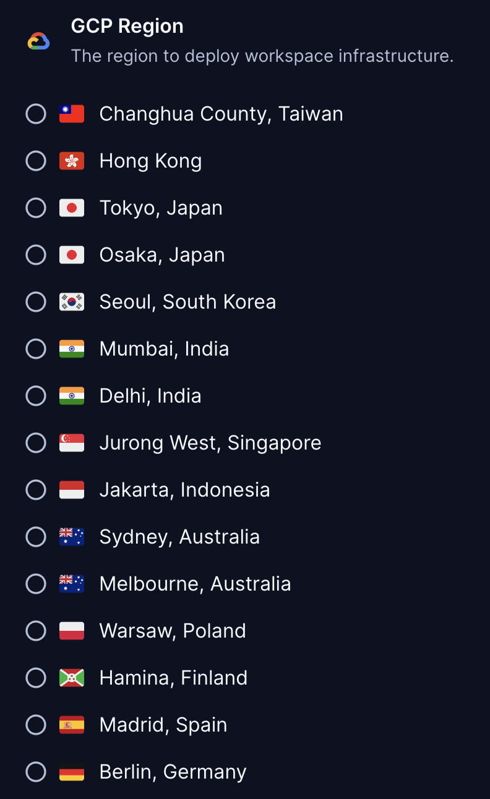

# Google Cloud Platform Regions

This module adds Google Cloud Platform regions to your Coder template.

```hcl
module "gcp_region" {
  source  = "registry.coder.com/modules/gcp-region/coder"
  version = "1.0.2"
  regions = ["us", "europe"]
}

resource "google_compute_instance" "example" {
  zone = module.gcp_region.value
}
```



## Examples

### Add only GPU zones in the US West 1 region

Note: setting `gpu_only = true` and using a default region without GPU support, the default will be set to `null`.

```hcl
module "gcp_region" {
  source   = "registry.coder.com/modules/gcp-region/coder"
  version  = "1.0.2"
  default  = ["us-west1-a"]
  regions  = ["us-west1"]
  gpu_only = false
}

resource "google_compute_instance" "example" {
  zone = module.gcp_region.value
}
```

### Add all zones in the Europe West region

```hcl
module "gcp_region" {
  source                 = "registry.coder.com/modules/gcp-region/coder"
  version                = "1.0.2"
  regions                = ["europe-west"]
  single_zone_per_region = false
}

resource "google_compute_instance" "example" {
  zone = module.gcp_region.value
}
```

### Add a single zone from each region in US and Europe that has GPUs

```hcl
module "gcp_region" {
  source                 = "registry.coder.com/modules/gcp-region/coder"
  version                = "1.0.2"
  regions                = ["us", "europe"]
  gpu_only               = true
  single_zone_per_region = true
}

resource "google_compute_instance" "example" {
  zone = module.gcp_region.value
}
```
