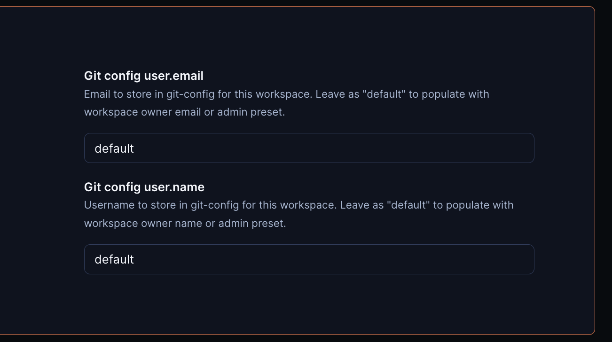

# git-config

Runs a script that checks for stored Git credentials `user.name` and `user.email`, populating them with workspace owner's credentials when missing.

## Examples

### Using workspace owner

The default credentials can be populated from the workspace owner's information.

```hcl
module "git-config" {
  source = "https://registry.coder.com/modules/git-config"
  agent_id = coder_agent.example.id
  default_username = data.coder_workspace.me.owner
  default_user_email = data.coder_workspace.me.owner_email
}
```

### Custom credentials

Credentials can also be set manually by the template admin.

```hcl
module "git-config" {
  source = "https://registry.coder.com/modules/git-config"
  agent_id = coder_agent.example.id
  default_username = "michael"
  user_email = "michael@example.com"
}
```

## Coder parameter usage

With the defaults set, users still have the opportunity to override the template admin's settings with the coder parameter interface. The workspace owner can manually add their credentials during workspace creation or leave them as "default".


