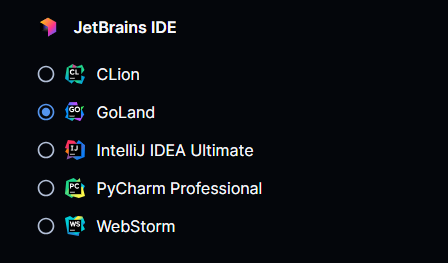

# JetBrains Gateway

This module adds a JetBrains Gateway Button to open any workspace with a single click.

```hcl
module "jetbrains_gateway" {
  source         = "https://registry.coder.com/modules/jetbrains-gateway"
  agent_id       = coder_agent.example.id
  folder         = "/home/coder/example"
  jetbrains_ides = ["GO", "WS", "IU", "PY", "PS", "CL", "RM"]
  default        = "PY"
}
```



## Examples

### Add GoLand and WebStorm with the default set to GoLand

```hcl
module "jetbrains_gateway" {
  source          = "https://registry.coder.com/modules/jetbrains-gateway"
  agent_id        = coder_agent.example.id
  folder          = "/home/coder/example"
  jetbrains_ides  = ["GO", "WS"]
  default         = "GO"
}
```

## Supported IDEs

This module and JetBrains Gateway support the following JetBrains IDEs:

- GoLand (`GO`)
- WebStorm (`WS`)
- IntelliJ IDEA Ultimate (`IU`)
- PyCharm Professional (`PY`)
- PhpStorm (`PS`)
- CLion (`CL`)
- RubyMine (`RM`)
