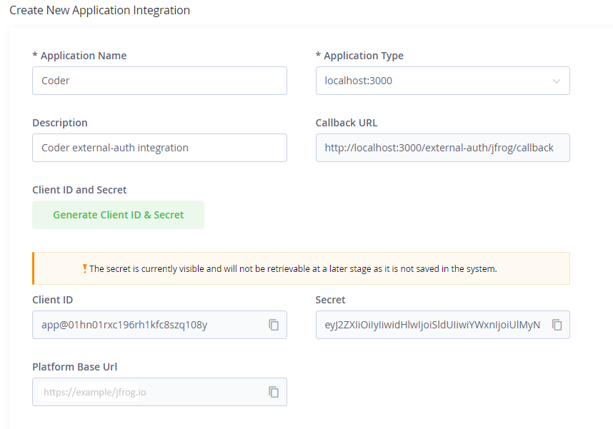

# JFrog

Install the JF CLI and authenticate package managers with Artifactory using OAuth configured via the Coder [`external-auth`](https://coder.com/docs/v2/latest/admin/external-auth) feature.


```hcl
module "jfrog" {
  source = "registry.coder.com/modules/jfrog-oauth/coder"
  version = "1.0.0"
  agent_id = coder_agent.example.id
  jfrog_url = "https://example.jfrog.io"
  username_field = "username" # If you are using GitHub to login to both Coder and Artifactory, use username_field = "username"
  package_managers = {
    "npm": "npm",
    "go": "go",
    "pypi": "pypi"
  }
}
```

> Note
> This module does not install `npm`, `go`, `pip`, etc but only configure them. You need to handle the installation of these tools yourself.

## Prerequisites

Coder [`external-auth`](https://coder.com/docs/v2/latest/admin/external-auth) configured with Artifactory. This requires a [custom integration](https://jfrog.com/help/r/jfrog-installation-setup-documentation/enable-new-integrations) in Artifactory with **Callback URL** set to `https://<your-coder-url>/external-auth/jfrog/callback`.

To set this up,

1. Modify your `values.yaml` for JFrog Artifactory to add,

```yaml
artifactory:
  enabled: true
  frontend:
  extraEnvironmentVariables:
    - name: JF_FRONTEND_FEATURETOGGLER_ACCESSINTEGRATION
      value: "true"
  access:
  accessConfig:
    integrations-enabled: true
    integration-templates:
      - id: "1"
        name: "CODER"
        redirect-uri: "https://CODER_URL/external-auth/jfrog/callback"
        scope: "applied-permissions/user"
```

> Note
> Replace `CODER_URL` with your Coder deployment URL, e.g., <coder.example.com>

2. Create a new Application Integration by going to <https://JFROG_URL/ui/admin/configuration/integrations/new> and select the Application Type as the integartion you created in step 1.


3. Add a new [external authetication](https://coder.com/docs/v2/latest/admin/external-auth) to Coder by setting these env variables,

```env
# JFrog Artifactory External Auth
CODER_EXTERNAL_AUTH_1_ID="jfrog"
CODER_EXTERNAL_AUTH_1_TYPE="jfrog"
CODER_EXTERNAL_AUTH_1_CLIENT_ID="YYYYYYYYYYYYYYY"
CODER_EXTERNAL_AUTH_1_CLIENT_SECRET="XXXXXXXXXXXXXXXXXXX"
CODER_EXTERNAL_AUTH_1_DISPLAY_NAME="JFrog Artifactory"
CODER_EXTERNAL_AUTH_1_DISPLAY_ICON="/icon/jfrog.svg"
CODER_EXTERNAL_AUTH_1_AUTH_URL="https://JFROG_URL/ui/authorization"
CODER_EXTERNAL_AUTH_1_SCOPES="applied-permissions/user"
```

> Note
> Replace `JFROG_URL` with your JFrog Artifactory base URL, e.g., <example.jfrog.io>

## Examples

Configure the Python pip package manager to fetch packages from Artifactory while mapping the Coder email to the Artifactory username.

```hcl
module "jfrog" {
  source = "registry.coder.com/modules/jfrog-oauth/coder"
  version = "1.0.0"
  agent_id = coder_agent.example.id
  jfrog_url = "https://example.jfrog.io"
  username_field = "email"
  package_managers = {
    "pypi": "pypi"
  }
}
```

You should now be able to install packages from Artifactory using both the `jf pip` and `pip` command.

```shell
jf pip install requests
```

```shell
pip install requests
```

### Configure code-server with JFrog extension

The [JFrog extension](https://open-vsx.org/extension/JFrog/jfrog-vscode-extension) for VS Code allows you to interact with Artifactory from within the IDE.

```hcl
module "jfrog" {
  source = "registry.coder.com/modules/jfrog-oauth/coder"
  version = "1.0.0"
  agent_id = coder_agent.example.id
  jfrog_url = "https://example.jfrog.io"
  username_field = "username" # If you are using GitHub to login to both Coder and Artifactory, use username_field = "username"
  configure_code_server = true # Add JFrog extension configuration for code-server
  package_managers = {
    "npm": "npm",
    "go": "go",
    "pypi": "pypi"
  }
}
```

### Using the access token in other terraform resources

JFrog Access token is also available as a terraform output. You can use it in other terraform resources. For example, you can use it to configure an [Artifactory docker registry](https://jfrog.com/help/r/jfrog-artifactory-documentation/docker-registry) with the [docker terraform provider](https://registry.terraform.io/providers/kreuzwerker/docker/latest/docs).

```hcl
provider "docker" {
  ...
  registry_auth {
    address = "https://example.jfrog.io/artifactory/api/docker/REPO-KEY"
    username = module.jfrog.username
    password = module.jfrog.access_token
  }
}
```
> Here `REPO_KEY` is the name of docker repository in Artifactory.
