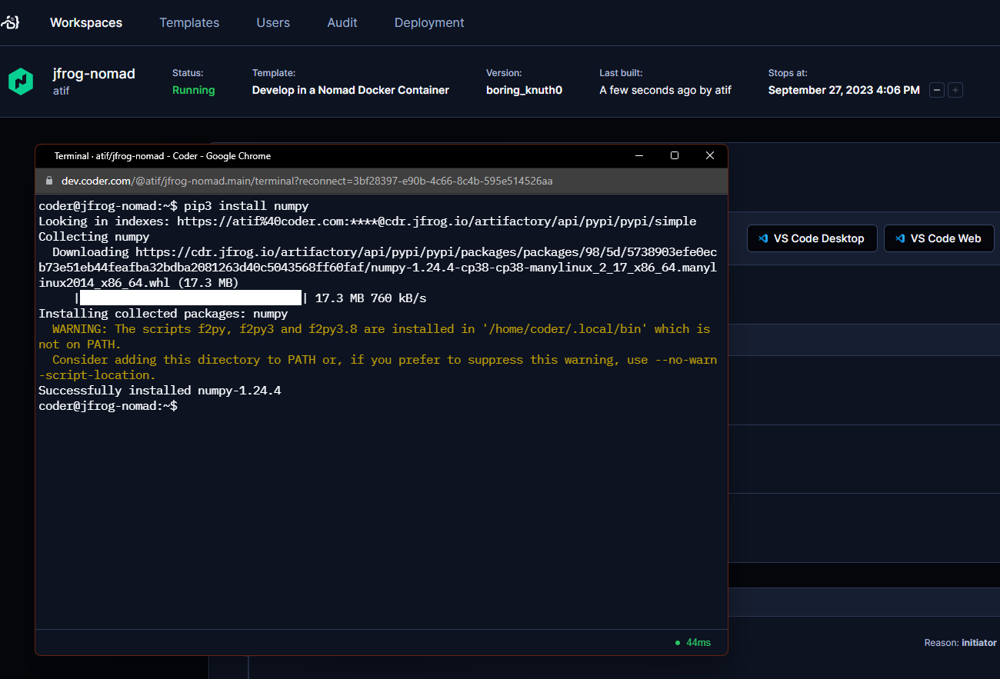

# JFrog

Install the JF CLI and authenticate package managers with Artifactory using Artifactory terraform provider.

```hcl
module "jfrog" {
    source = "https://registry.coder.com/modules/jfrog-token"
    agent_id = coder_agent.example.id
    jfrog_url = "https://XXXX.jfrog.io"
    artifactory_access_token = var.artifactory_access_token
    package_managers = {
      "npm": "npm",
      "go": "go",
      "pypi": "pypi"
    }
}
```

Get a JFrog access token from your Artifactory instance. The token must be an [admin token](https://registry.terraform.io/providers/jfrog/artifactory/latest/docs#access-token). It is recommended to store the token in a secret terraform variable.

```hcl
variable "artifactory_access_token" {
    type      = string
    sensitive = true
}
```



## Examples

### Configure npm, go, and pypi to use Artifactory local repositories

```hcl
module "jfrog" {
    source = "https://registry.coder.com/modules/jfrog-token"
    agent_id = coder_agent.example.id
    jfrog_url = "https://YYYY.jfrog.io"
    artifactory_access_token = var.artifactory_access_token # An admin access token
    package_managers = {
      "npm": "npm-local",
      "go": "go-local",
      "pypi": "pypi-local"
    }
}
```

You should now be able to install packages from Artifactory using both the `jf npm`, `jf go`, `jf pip` and `npm`, `go`, `pip` commands.

```shell
jf npm install prettier
jf go get github.com/golang/example/hello
jf pip install requests
```

```shell
npm install prettier
go get github.com/golang/example/hello
pip install requests
```

### Using the access token in other terraform resources

JFrog Access token is also available as a terraform output. You can use it in other terraform resources. For example, you can use it to configure an [Artifactory docker registry](https://jfrog.com/help/r/jfrog-artifactory-documentation/docker-registry) with the [docker terraform provider](https://registry.terraform.io/providers/kreuzwerker/docker/latest/docs).

```hcl

provider "docker" {
  ...
  registry_auth {
    address = "https://YYYY.jfrog.io/artifactory/api/docker/REPO-KEY"
    username = module.jfrog.username
    password = module.jfrog.access_token
  }
}
```
