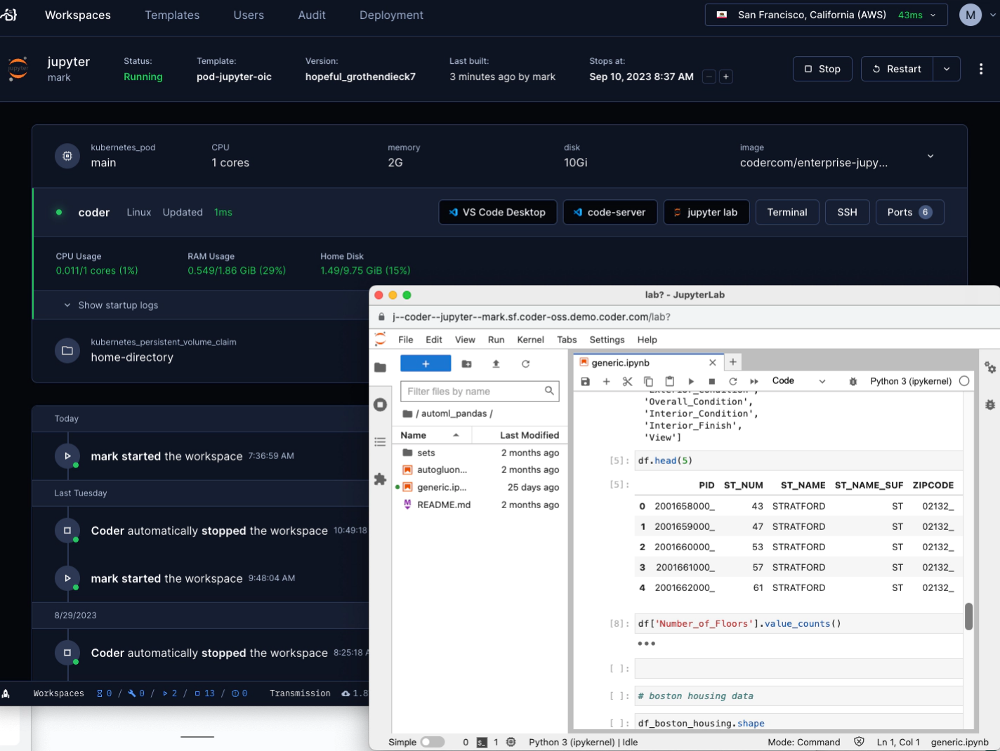

# JupyterLab

A module that adds JupyterLab in your Coder template.



```tf
module "jupyterlab" {
  count    = data.coder_workspace.me.start_count
  source   = "registry.coder.com/modules/jupyterlab/coder"
  version  = "1.0.30"
  agent_id = coder_agent.example.id
}
```
