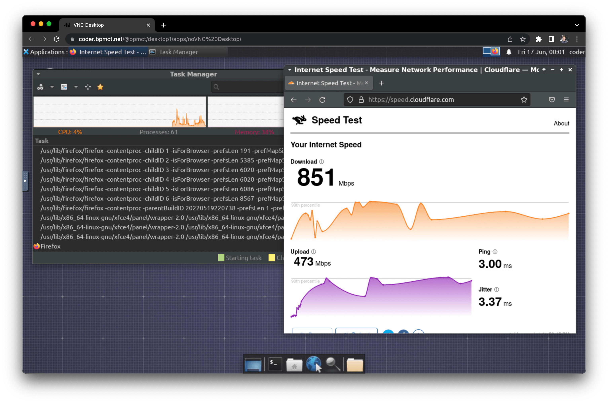

# KasmVNC

Automatically install [KasmVNC](https://kasmweb.com/kasmvnc.png) in a workspace, and create an app to access it via the dashboard.



## Examples

1. Add latest version of KasmVNC with [`lxde`](https://www.lxde.org/) desktop environment:

   ```hcl
   module "kasmvnc" {
     source   = "https://registry.coder.com/modules/kasmvnc"
     agent_id = coder_agent.example.id
   }

   ```

2. Add specific version of KasmVNC with [`mate`](https://mate-desktop.org/) desktop environment and custom port:

   ```hcl
   module "kasmvnc" {
     source              = "https://registry.coder.com/modules/kasmvnc"
     agent_id            = coder_agent.example.id
     custom_version      = "1.0.0"
     desktop_environment = "mate"
     port                = 6080
   }
   ```

3. Use custom timezone and locale:

   ```hcl
   module "kasmvnc" {
     source              = "https://registry.coder.com/modules/kasmvnc"
     agent_id            = coder_agent.example.id
     custom_version      = "1.0.0"
     desktop_environment = "mate"
     port                = 6080
     locale              = "en_US.UTF-8"
     timezone            = "America/Los_Angeles"
   }
   ```

   > **Note:** It is recommended to pre-install a desktop environment in your Dockerfile/VM image to speed up the startup time of your workspace.
