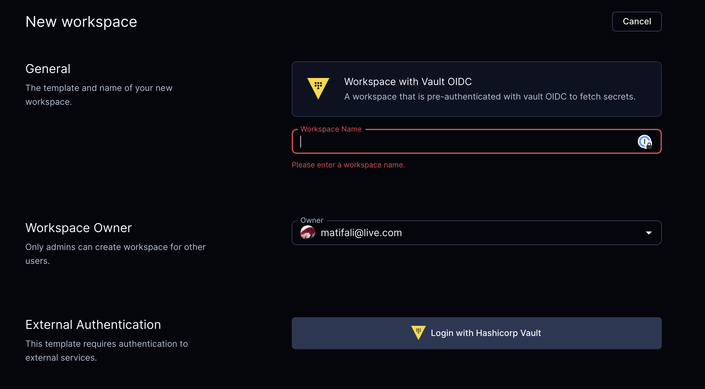

# Hashicorp Vault Integration (GitHub)

This module lets you authenticate with [Hashicorp Vault](https://www.vaultproject.io/) in your Coder workspaces using [external auth](https://coder.com/docs/v2/latest/admin/external-auth) for GitHub.

```tf
module "vault" {
  count      = data.coder_workspace.me.start_count
  source     = "registry.coder.com/modules/vault-github/coder"
  version    = "1.0.7"
  agent_id   = coder_agent.example.id
  vault_addr = "https://vault.example.com"
}
```

Then you can use the Vault CLI in your workspaces to fetch secrets from Vault:

```shell
vault kv get -namespace=coder -mount=secrets coder
```

or using the Vault API:

```shell
curl -H "X-Vault-Token: ${VAULT_TOKEN}" -X GET "${VAULT_ADDR}/v1/coder/secrets/data/coder"
```



## Configuration

To configure the Vault module, you must set up a Vault GitHub auth method. See the [Vault documentation](https://www.vaultproject.io/docs/auth/github) for more information.

## Examples

### Configure Vault integration with a different Coder GitHub external auth ID (i.e., not the default `github`)

```tf
module "vault" {
  count                = data.coder_workspace.me.start_count
  source               = "registry.coder.com/modules/vault-github/coder"
  version              = "1.0.7"
  agent_id             = coder_agent.example.id
  vault_addr           = "https://vault.example.com"
  coder_github_auth_id = "my-github-auth-id"
}
```

### Configure Vault integration with a different Coder GitHub external auth ID and a different Vault GitHub auth path

```tf
module "vault" {
  count                  = data.coder_workspace.me.start_count
  source                 = "registry.coder.com/modules/vault-github/coder"
  version                = "1.0.7"
  agent_id               = coder_agent.example.id
  vault_addr             = "https://vault.example.com"
  coder_github_auth_id   = "my-github-auth-id"
  vault_github_auth_path = "my-github-auth-path"
}
```

### Configure Vault integration and install a specific version of the Vault CLI

```tf
module "vault" {
  count             = data.coder_workspace.me.start_count
  source            = "registry.coder.com/modules/vault-github/coder"
  version           = "1.0.7"
  agent_id          = coder_agent.example.id
  vault_addr        = "https://vault.example.com"
  vault_cli_version = "1.15.0"
}
```
