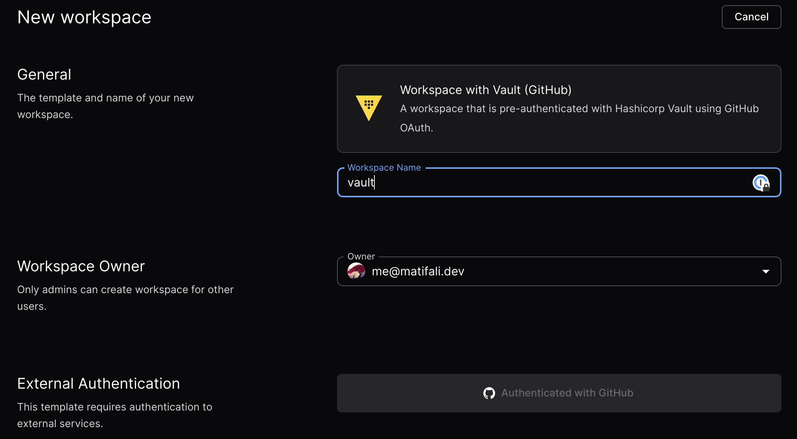

# Hashicorp Vault Integration (Token)

This module lets you authenticate with [Hashicorp Vault](https://www.vaultproject.io/) in your Coder workspaces using a [Vault token](https://developer.hashicorp.com/vault/docs/auth/token).

```tf
module "vault" {
  source      = "registry.coder.com/modules/vault-token/coder"
  version     = "1.0.2"
  agent_id    = coder_agent.example.id
  vault_token = "s.1234567890"
  vault_addr  = "https://vault.example.com"
}
```

Then you can use the Vault CLI in your workspaces to fetch secrets from Vault:

```shell
vault kv get -mount=secret my-secret
```

or using the Vault API:

```shell
curl -H "X-Vault-Token: ${VAULT_TOKEN}" -X GET "${VAULT_ADDR}/v1/secret/data/my-secret"
```



## Configuration

To configure the Vault module, you must create a Vault token with the the required permissions and configure the module with the token and Vault address.

## Examples

### Configure Vault integration and install a specific version of the Vault CLI

```tf
module "vault" {
  source            = "registry.coder.com/modules/vault-token/coder"
  version           = "1.0.2"
  agent_id          = coder_agent.example.id
  vault_addr        = "https://vault.example.com"
  vault_cli_version = "1.15.0"
}
```
