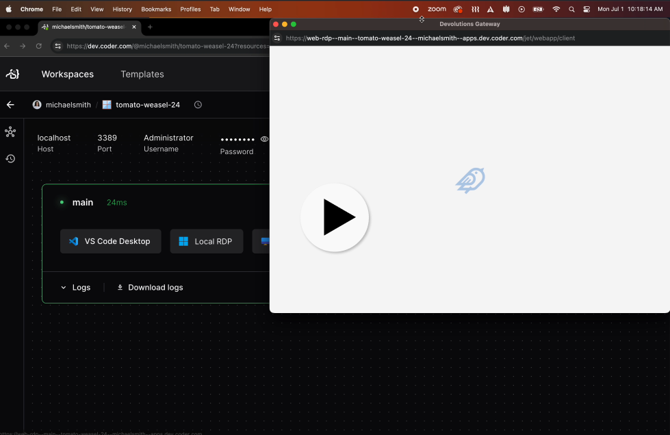

# Windows RDP

Enable Remote Desktop + a web based client on Windows workspaces, powered by [devolutions-gateway](https://github.com/Devolutions/devolutions-gateway).

```tf
# AWS example. See below for examples of using this module with other providers
module "windows_rdp" {
  count       = data.coder_workspace.me.start_count
  source      = "registry.coder.com/modules/windows-rdp/coder"
  version     = "1.0.18"
  agent_id    = resource.coder_agent.main.id
  resource_id = resource.aws_instance.dev.id
}
```

## Video

[](https://github.com/coder/modules/assets/28937484/fb5f4a55-7b69-4550-ab62-301e13a4be02)

## Examples

### With AWS

```tf
module "windows_rdp" {
  count       = data.coder_workspace.me.start_count
  source      = "registry.coder.com/modules/windows-rdp/coder"
  version     = "1.0.18"
  agent_id    = resource.coder_agent.main.id
  resource_id = resource.aws_instance.dev.id
}
```

### With Google Cloud

```tf
module "windows_rdp" {
  count       = data.coder_workspace.me.start_count
  source      = "registry.coder.com/modules/windows-rdp/coder"
  version     = "1.0.18"
  agent_id    = resource.coder_agent.main.id
  resource_id = resource.google_compute_instance.dev[0].id
}
```

## Roadmap

- [ ] Test on Microsoft Azure.
